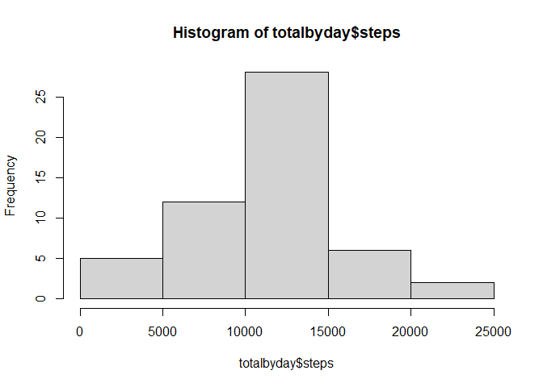
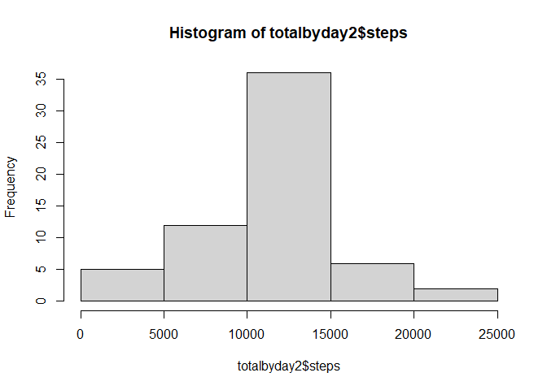
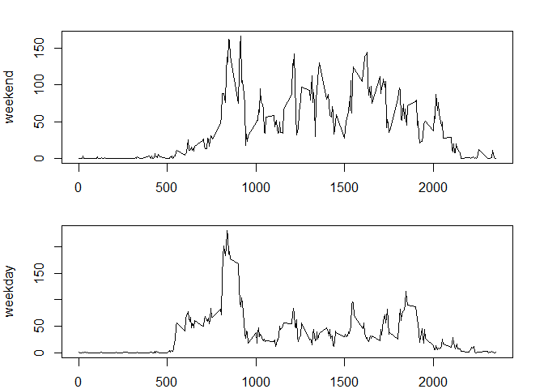

## Loading and preprocessing the data

```r
setwd("~/R/courseraRtraining/5-ReproducibleData")
activity<-read.csv("activity.csv")
str(activity)
```

```
## 'data.frame':	17568 obs. of  3 variables:
##  $ steps   : int  NA NA NA NA NA NA NA NA NA NA ...
##  $ date    : chr  "2012-10-01" "2012-10-01" "2012-10-01" "2012-10-01" ...
##  $ interval: int  0 5 10 15 20 25 30 35 40 45 ...
```

```r
activity$date<-as.Date(activity$date,"%Y-%m-%d")
summary(activity)
```

```
##      steps             date               interval     
##  Min.   :  0.00   Min.   :2012-10-01   Min.   :   0.0  
##  1st Qu.:  0.00   1st Qu.:2012-10-16   1st Qu.: 588.8  
##  Median :  0.00   Median :2012-10-31   Median :1177.5  
##  Mean   : 37.38   Mean   :2012-10-31   Mean   :1177.5  
##  3rd Qu.: 12.00   3rd Qu.:2012-11-15   3rd Qu.:1766.2  
##  Max.   :806.00   Max.   :2012-11-30   Max.   :2355.0  
##  NA's   :2304
```

## What is the mean total number of steps taken per day?  
### 1. Calculate the total number of steps taken per day  

```r
totalbyday<-aggregate(steps~date,activity,sum)
```

### 2. Make a histogram of the total number of steps taken per day  

```r
hist(totalbyday$steps)
```

<!-- -->

### 3. Calculate and report the mean and median of total number of steps taken per day  

```r
mean(totalbyday$steps,na.rm=TRUE)
```

```
## [1] 10766.19
```

```r
median(totalbyday$steps,na.rm=TRUE)
```

```
## [1] 10765
```


## What is the average daily activity pattern?  
### 1. Make a time series plot of the 5-minute interval (x-axis) and the average number of steps taken, averaged across all days (y-axis)  

```r
avebyint<-aggregate(steps~interval,activity,mean,na.rm=TRUE)
with(avebyint,plot(interval,steps,type="l"))
```

<!-- -->

### 2. Which 5-minute interval, on average across all the days in the dataset, contains the maximum number of steps?  

```r
avebyint$interval[which(avebyint$steps==max(avebyint$steps))]
```

```
## [1] 835
```

## Imputing missing values  
### 1. Calculate and report the total number of missing values in the dataset.  

```r
sum(is.na(activity$steps))
```

```
## [1] 2304
```

### 2. Devise a strategy for filling in all the missing values of the dataset.  
Filling in missing values of mean for 5-second interval.

### 3. Create a new dataset equal to original dataset but with missing values filled in.  

```r
activity2<-activity
for(i in 1:length(activity2$steps)){
  if(is.na(activity2$steps[i])){
    int<-activity2$interval[i]
    ave<-avebyint$steps[which(avebyint$interval==int)]
    activity2$steps[i]=ave
  }
}
```

### 4. Make a histogram of the total number of steps taken each day and Calculate and report the mean and median total number of steps taken per day.   

```r
totalbyday2<-aggregate(steps~date,activity2,sum)
hist(totalbyday2$steps)
```

<!-- -->

```r
mean(totalbyday2$steps)
```

```
## [1] 10766.19
```

```r
median(totalbyday2$steps)
```

```
## [1] 10766.19
```
Do these values differ from the estimates from the first part of the assignment? What is the impact of imputing missing data on the estimates of the total daily number of steps?  
The mean daily steps does not change when imputing the missing data, but the median shifts up to equal the mean.

## Are there differences in activity patterns between weekdays and weekends?  
### 1. Create a new factor variable in the dataset with two levels - "weekday" and "weekend" indicating whether a given date is a weekday or weekend day.  

```r
day<-weekdays(activity2$date)
daytype<-ifelse(day=="Saturday"|day=="Sunday","weekend","weekday")
activity2$daytype<-factor(daytype,levels=c("weekend","weekday"))
```

### 2. Make a panel plot containing a time series plot of the 5-minute interval (x-axis) and the average number of steps taken, averaged across all weekday days or weekend days (y-axis).  

```r
avesteps<-matrix(nrow=288,ncol=3)
colnames(avesteps)<-c("interval","weekend","weekday")
avesteps[,1]<-avebyint[,1]
weekendsteps<-aggregate(steps~interval,subset=daytype=="weekend",activity2,mean)
avesteps[,2]<-weekendsteps[,2]
weekdaysteps<-aggregate(steps~interval,subset=daytype=="weekday",activity2,mean)
avesteps[,3]<-weekdaysteps[,2]
avesteps<-as.data.frame(avesteps)

par(mfrow=c(2,1),mar=c(2,4,2,2))
with(avesteps,{
  plot(interval,weekend,type="l")
  plot(interval,weekday,type="l")
})
```

<!-- -->
